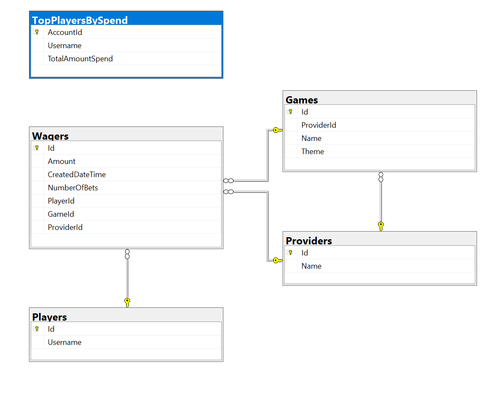

NOTES

database design

As seen in the screenshot above I opted to have everything link to the wager entity. This allows for easier queries further down the line if i wanted to check which games are being played or which providers are more popular.

There is an outlier table for the TopPlayersBySpend this table is used in order to call the GetTopPlayersBySpend stored proc and serves no other purpose.
this can potentially be removed in the future if I was to use dapper to call the proc instead but for consistency i tried to run all db queries through entity framework.

The Db was created using code first migrations as later down the line either a migrator can be added to be run on pipelines or the pipelines can run the migrations itself.These migrations will also create the stored procedure in the db.

Solution Design:

For the solution design itself. I opted to split the project into having a entity framework and shared project so that they can freely be used between both the consumer and App.

This choice also extended into the rabbitmq implementations where there is one created specifically for consuming and one for producing.
One major potential improvement that can be made is that when messages are published some sort of response is sent made in order to track success rates outside of exception catching but i am not too sure how this would affect performance.

Potential Improvements:

Dependency injection can be refined to remove some of the tight coupling that has resulted fromm the projects being shared.
Database queries can also potentially be changed to run in batch jobs to make db queries faster however alot more logic will need to be implemented to ensure that duplication does not occur.